# Pub Quiz

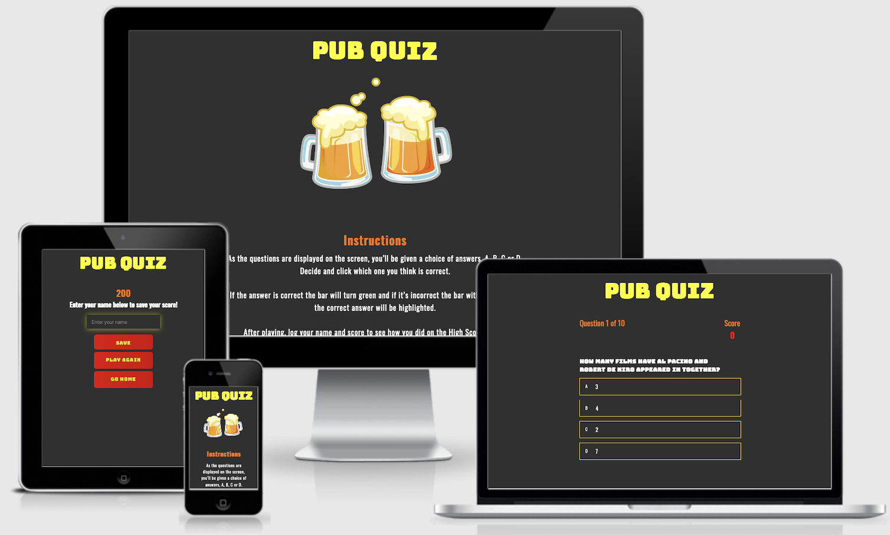

[View the website here](https://emmacharleswilson.github.io/Pub-Quiz/)

## Introduction 

This website has been produced to provide a platform for a fun and educational game designed for agers 16+. It offers questions in a quiz format to test the users general knowledge.

In addition to the home page this website also features:
- The 'Quiz' page
- A 'Instructions section'
- A 'High Scores' page

The business goals of the website are:
1. To provide an educational learning platform for people aged 16+.
2. To provide engaging content so that users enjoy using this quiz.
3. To create an easy to navigate website to ensure that it is user friendly.

The user goals of this website are:
1. To gain general knowledge.
2. To test my general knowledge using the quiz.
3. To improve my previous scores & therefore my overall knowledge.

--- 
## UX

### Strategy
Using the core UX principles I first started with Strategy, thinking about the target audience for this quiz & the features they would want.

The target audience for 'Pub Quiz' are:
- People aged 16+
- People who are interested in Pub Quizzes.
- People who want to improve their general knowledge. 

Features that they would need to be included:
- A fun & interactive quiz
- The ability to track their high scores so they can see if they're improving

It was imperative to me that this website was simple & easy to use to ensure that the users had an enjoyable experience; therefore each page has a limited amount of information, written in simple language. 

The website has been designed to work well on desktops & tablets as well, to ensure that no matter the device the user has a positive user experience.

### Scope
To achieve the desired user and business goals this website will include the following:
1. A landing page with:
- A `H1` animated heading
- An animated picture
- Start game button
- A High Scores button 

2. Quiz Page:
- A `H1` animated heading
- Question counter
- A score count 
- Quiz qustions 
- 4 answer options 

4. End of quiz page:
- A `H1` animated heading 
- Form to submit name and high score
- Control buttons

5. High Scores page:
- A `H1` animated heading
- List of top 5 high scores
- Go Home button 

### Structure
This is a multi-page website to keep the amount of information on each page limited and easy to digest; the rules, game and high scores are all separated so that any one using the website can find what they want easily.
Each page is designed with simplicity in mind, with a H1 element that returns the user home and the relevant content centred below; this simplicity will allow for users to feel comfortable using and navigating each page. 
The quiz itself has a question, and four possible answers to pick from. This layout will be responsive so that it isn't too squashed when being viewed on a smaller screen.

### Skeleton
`Home Page`
[View wireframes here](assets/readme-files/home-page.png) 

`Instructions`
[View wireframes here](assets/readme-files/instructions.png) 

`Quiz` 
[View wireframes here](assets/readme-files/quiz.png) 

`High Scores page`
[View wireframes here](assets/readme-files/high-scores.png) 

I made a few changes to the design post creating the wireframes. These include removal of the toggle menu as there wasn't many items included there and also collapsing the instructions into one section which can be found on the home page. 

### Surface
I chose to use a background colour of dark Slate Grey. For the title I chose a bright yellow to make sure this was clear to read and bold. For the subheadings and footer I chose orange to compliment the other colour's used. For any content text I chose the colour white to really make this stand out and easy to read. For any buttons, I chose to highlight these is red to draw the user to them, and the text within them yellow. I feel that this colour palet is very gender nutral, highlights the element's that are important to the user which makes navigating the website easier. 

The font used is `Oswald` and `Bungee`. The font `Bungee` is used as the main title and for the questions. The remaining elements are all in the font `Oswald`. 

---
## Features 

### All pages
#### *Navbar*
The navbar features on all pages & is fully responsive and returns the user to the home page when clicked. 

### *Title* 
All page titles are `H1` elements, they are centred and large in size so there is no ambiguity as to which page the user is on. Clicking this will return the user to the Home Page.

### *Buttons*
All of the navigation buttons throughout the site are styled in the same way, using a bold colour of red and a hover effect to draw the user to them. 

### Home page
#### *Animated Gif*
The animated gif was implimented to create a fun and intriuging landing page. 

#### *Animated heading*
In addition to the gif I chose to animate the heading to continue that feeling of fun, I felt this would entice users over a static heading.

#### *Start Game button*
I wanted to keep this on the Home Page to make it easy for the user to find and the website easy to navigate. 

#### *High Scores button*
After removing my toggle menu it was apparent that the High Scores needs to be accessible from the Home Page, to allow the users to visit this easily. 

### Instructions
#### *Instructions list*
The list of rules is an `ul` element, it has been styled to remain in the centre of the screen to allow for better responsivity.

### Quiz
#### *Quiz elements*
The quiz is made up of the following: 
- Two progress items (question & score counts), which remain at the top of the quiz on opposite sides of the page so the user can see their progress.
- Question, this is dynamically created each time a new question is generated but always remains in the centre of the screen.
- Answer buttons, these are styled in a simple way to highlight the answer choices. The border colour will change on the user answering correctly or incorrectly. 

### End page

#### *Save score form*
For the user to save their score to the High Scores page they need to input their username and click save, this is done using a form made up of a text input and submit button. On clicking save the user will be directed to the High Scores Page. 

### High Scores
#### *High Scores Leaderboard*
The High Scores Leaderboard is an `ul` element, it has been styled to remain in the centre of the screen to allow for better responsivity. The scores in this list are generated in `highscores.js` using local storage.

---
## Technologies Used
I have used several technologies that have enabled this design to work:

- [HTML](https://developer.mozilla.org/en-US/docs/Web/HTML)
    - Used as the basic building block for the project and to structure the content.
- [CSS](https://developer.mozilla.org/en-US/docs/Learn/Getting_started_with_the_web/CSS_basics)
    - Used to style all the web content across the project. 
- [JavaScript](https://www.javascript.com/)
    - Used for the responsive navbar, animated heading, quiz functionality & sound effects and high-scores leaderboard.
- [Google Fonts](https://fonts.google.com/)
    - Used to obtain the fonts linked in the header, fonts used were Playfair and Cookie
- [Font Awesome](https://fontawesome.com/)
    - Used to obtain the icons used on the high scores and rules pages.
- [Google Developer Tools](https://developers.google.com/web/tools/chrome-devtools)
    - Used as a primary method of fixing spacing issues, finding bugs, and testing responsiveness across the project.
- [GitHub](https://github.com/)
    - Used to store code for the project after being pushed.
- [Git](https://git-scm.com/)
    - Used for version control by utilising the Gitpod terminal to commit to Git and Push to GitHub.
- [Gitpod](https://www.gitpod.io/)
    - Used as the development environment.
- [Balsamiq](https://balsamiq.com/)
    - Used to create the wireframes for the project.
- [Grammarly](https://www.grammarly.com/)
    - Used to fix the grammar errors across the project.
- [W3C Markup Validation Service](https://validator.w3.org/) 
    - Used to validate all HTML code written and used in this webpage.
- [W3C CSS Validation Service](https://jigsaw.w3.org/css-validator/#validate_by_input)
    - Used to validate all CSS code written and used in this webpage.
- [AmIResponsive](http://ami.responsivedesign.is/)
    - Used to generate responsive image used in README file.
---
## Testing

### User Stories 
1. **As a first time user, I want to be able to navigate my way easily throughout the website.**
The navbar being placed right at the top of all pages allows the user to return to the home page at any point. To improve this in furture I would probably include an animation that points this action out to the user as some user's may not know to click the Pub Quiz heading to return home. 
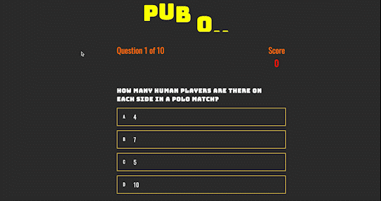

2. **As a first time user, I want to expland my general knowledge by playing a quiz game.**
As part of the quiz design, I added visual cues so that the user will know when they have answered a question correctly or incorrectly. This instant feedback will allow them to learn as they play the quiz. In future I think it would be benefitial to the user if when they get the answer incorrect the correct answer is also highlighted. 
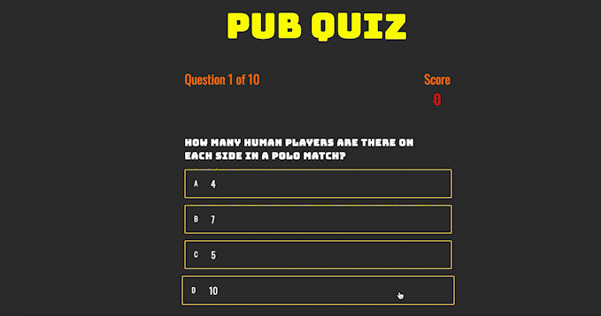

3. **As a recurring user, I want to track my scores to see if I've made the high scores leaderboard.**
Upon completing the quiz the user is taken to the end page, where they are able to save their score against their username, the top 5 scores saved to local storage are then displayed on the high scores page:
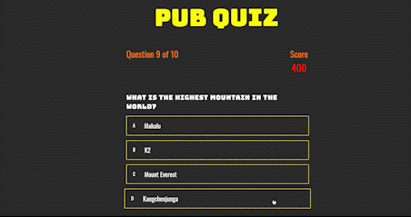

### Lighthouse
I used the Lighthouse report on Google Dev Tools to test my websites performance, accessibility and best practices. The results are as followed: 
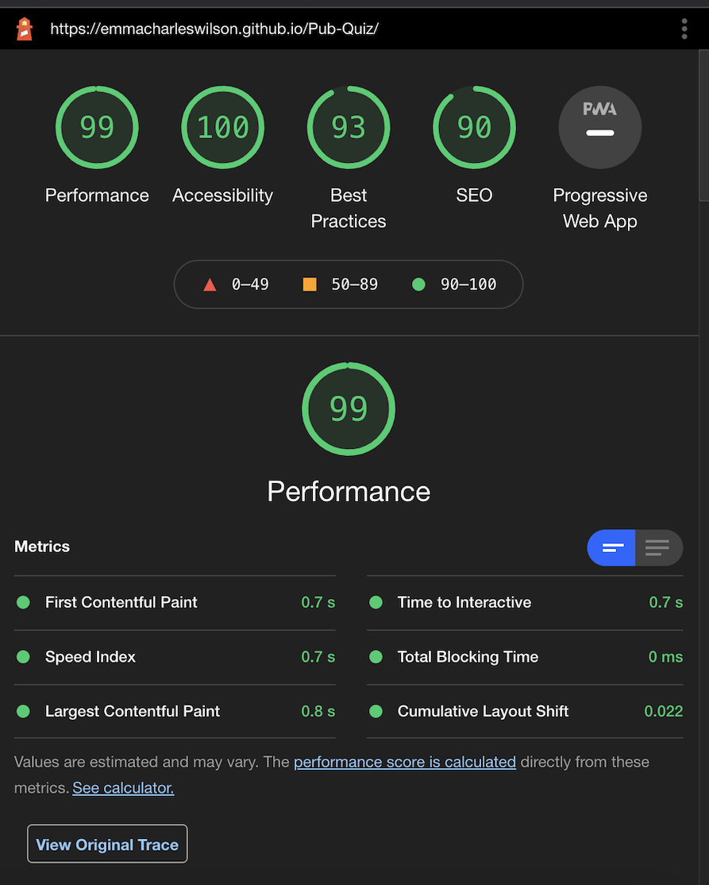

### Known bugs and fixes
Throughout the entire project, I have used Google Chrome Developer Tools to debug any issues with styling and alignment; this tool enabled me to change things and see the effect this had immediately. The use of the console whilst in dev tools was also incredibly helpful as I was able to utilise this to test my JavaScript code, using `console.log()` to check that my functions were being called correctly and that the desired information was going to be displayed. This was pivotal in designing the quiz as I needed to have access to the information of the various elements in order to be able to programme the quiz correctly.

I tested the quizzes functionality by 'playing' it myself, to ensure the user experience was positive and that everything was working as it should. 

**404 error**
On mobile, when the user completed the quiz and tried to save their name and score, instead of being redirected to the High Scores page it was coming up with a 404 error. I fixed this by removing the '/' before highscores.html in the game.html file. 

**title underline** 
On mobile and desktop there was a small line between Pub and Quiz in my heading. I resolved this by setting the text-decoration to none in my CSS. 

### Validation: HTML, CSS and JavaScript
Furthermore, I used Jshint to ensure that there were no errors within any of my JavaScript code, initially there were errors as you can see below:
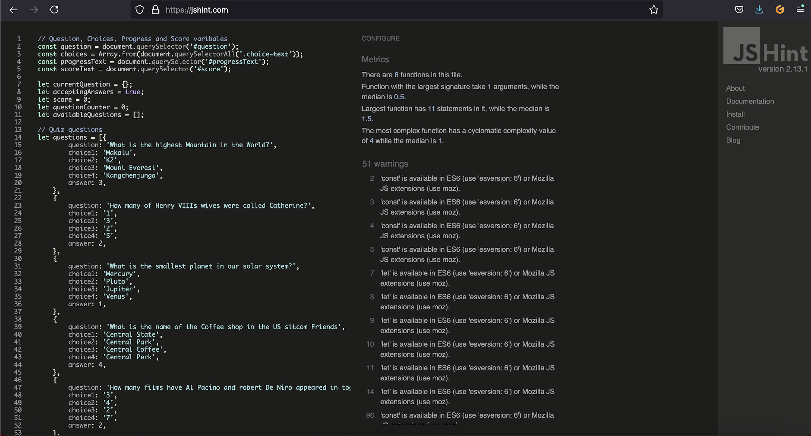

However, I implemented all changes to ensure my code passed with no errors:
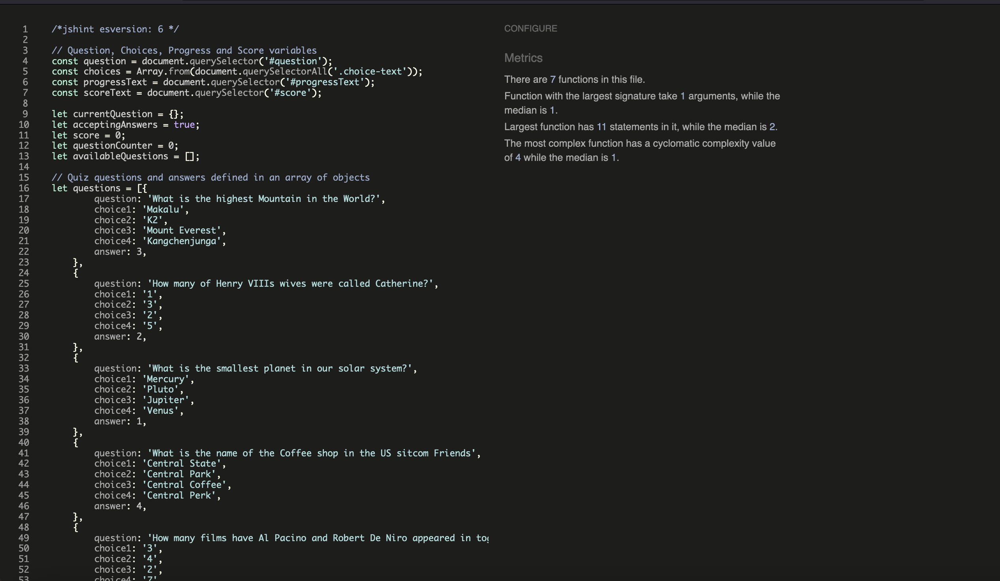
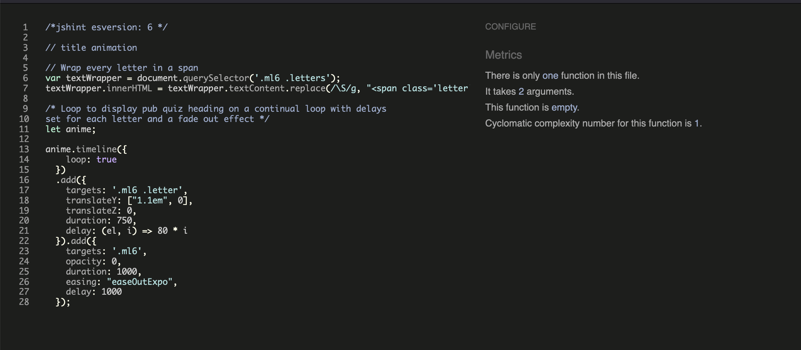
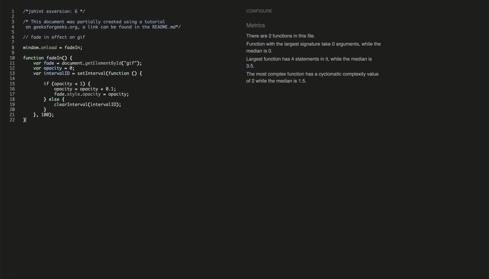
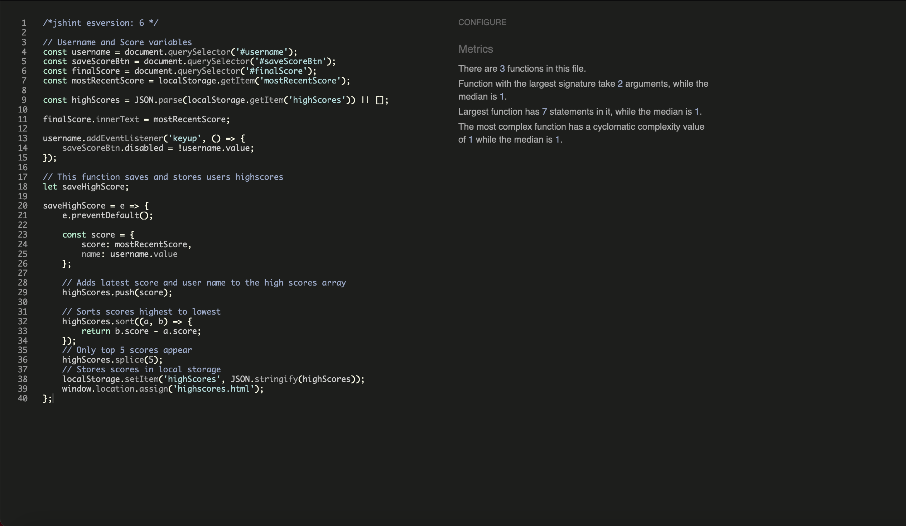
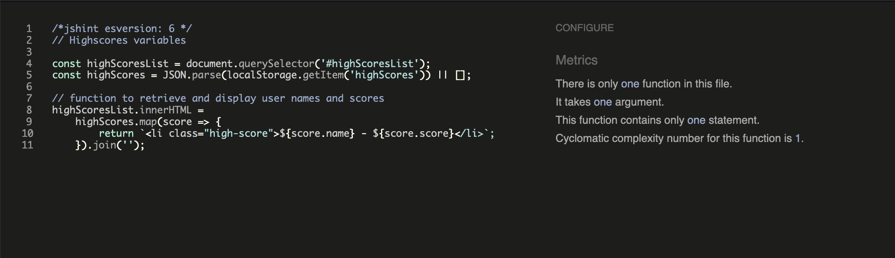

In addition to Jshint, I used Jigsaw to validate my HTML and CSS which pass with no errors:

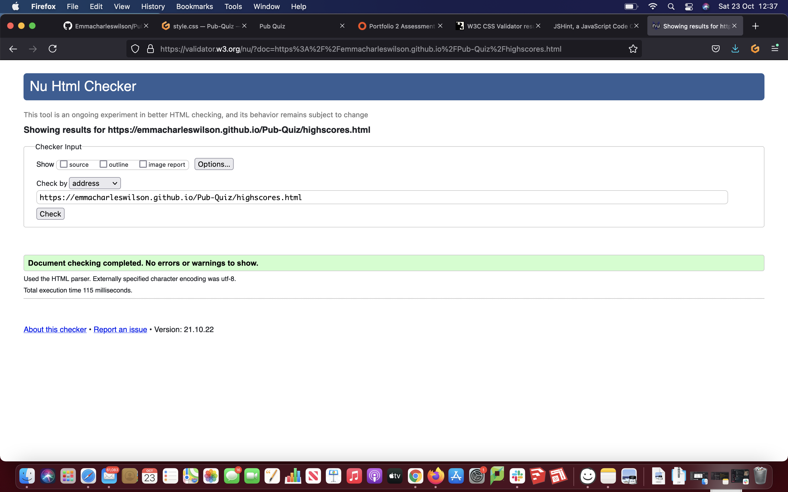

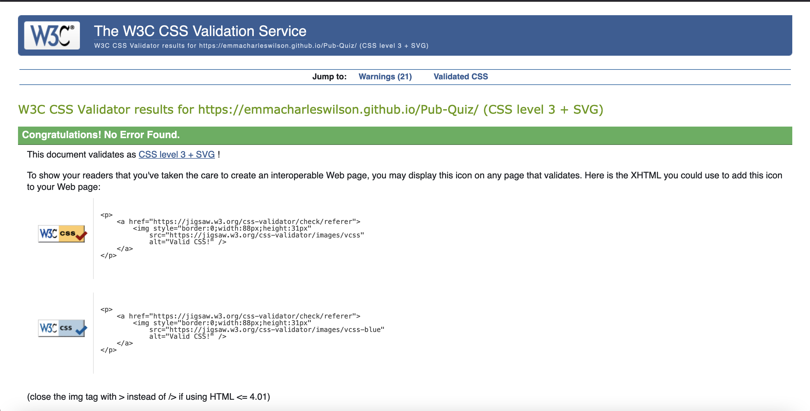

In addition to testing that I conducted, I got my friends, family & fellow students to test the website on their phones/laptops/tablets/desktops and provide feedback on anything they felt didn't work or look right, this enabled me to debug any issues that I might not have otherwise found.

---
## Deployment
I deployed this website by using GitPages and following the below steps:

### GitHub pages deployment

1. Log in to GitHub
2. In your Repository section, select the project repository that you want to deploy
3. In the menu located at the top of this section, click 'Settings'
4. Select 'Pages' on the left-hand menu - this is around halfway down
5. In the source section, select branch 'Master' and save
6. The page is then given a site URL which you will see above the source section, it will look like the following:

Please note it can take a while for this link to become fully active.

### Forking the GitHub Repository

If you want to make changes to your repository without affecting it, you can make a copy of it by 'Forking' it. This ensures your original repository remains unchanged.

1. Find the relevant GitHub repository
2. In the top right corner of the page, click the Fork button (under your account)
3. Your repository has now been 'Forked' and you have a copy to work on

### Cloning the GitHub Repository

Cloning your repository will allow you to download a local version of the repository to be worked on. Cloning can also be a great way to backup your work.

1. Find the relevant GitHub repository
2. Press the arrow on the Code button
3. Copy the link that is shown in the drop-down
4. Now open Gitpod & select the directory location where you would like the clone created
5. In the terminal type 'git clone' & then paste the link you copied in GitHub
6. Press enter and your local clone will be created.
---
## Credits
I have used several resources to produce this website.

The following websites/articles were used for research and guidance:

[Stack Overflow](https://stackoverflow.com/)

[W3Schools](https://www.w3schools.com/)

I obtained code from the following resources:

[Vanilla JavaScript quiz tutorial](https://www.youtube.com/watch?v=f4fB9Xg2JEY)

[Animated heading code](https://tobiasahlin.com/moving-letters/#6)

[Animated fade effect on Gif](https://www.geeksforgeeks.orghow-to-add-fade-in-effect-using-pure-javascript/)

The below sources were used for content: 

[Gif on Home Page](https://gfycat.com/@gfycatstickers)

[Quiz questions](https://www.radiotimes.com)

[Instructions](https://www.mobygames.com/game/dvd-player/pub-quiz-volume-1/screenshots/gameShotId,905437/)

---
## Acknowledgements

I would like to thank my course mentor Guido Cecilio for his support and guidance throughout the course of the project and my fellow students Harry Dhillon and Daisy Gunn for their support & feedback.

## Notes 

As I recieved my feedback for my P1 after starting this project I have not been able to implement the advice given by the assessor throughout my project. Please note this when looking at my commits. I am aware that some are not as descriptive as they should be. I have tried to be more explanatory going forward. Thank you! 
